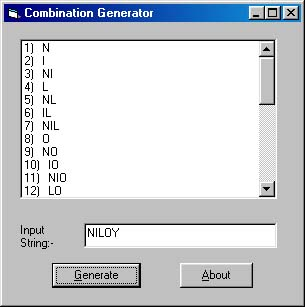



## ^Combination Generator^

### Description

This is a small Program which generates Combinations of Characters of a given string. The code is small (just 26 lines).
 
### More Info
 

             |
---                |---
**Submitted On**   |2002-08-23 13:38:18
**By**             |[Niloy Mondal](https://github.com/Planet-Source-Code/PSCIndex/blob/master/ByAuthor/niloy-mondal.md)
**Level**          |Beginner
**User Rating**    |3.6 (18 globes from 5 users)
**Compatibility**  |VB 6\.0
**Category**       |[Math/ Dates](https://github.com/Planet-Source-Code/PSCIndex/blob/master/ByCategory/math-dates__1-37.md)
**World**          |[Visual Basic](https://github.com/Planet-Source-Code/PSCIndex/blob/master/ByWorld/visual-basic.md)
**Archive File**   |[^Combinati1214878232002\.zip](https://github.com/Planet-Source-Code/niloy-mondal-combination-generator__1-38187/archive/master.zip)

